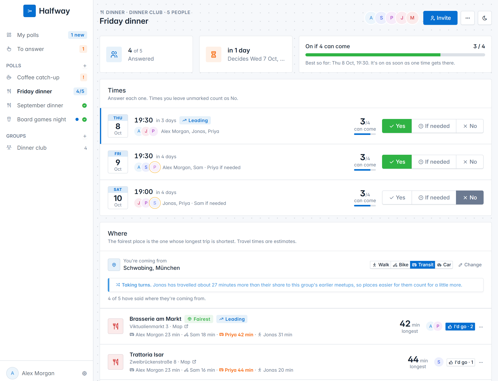
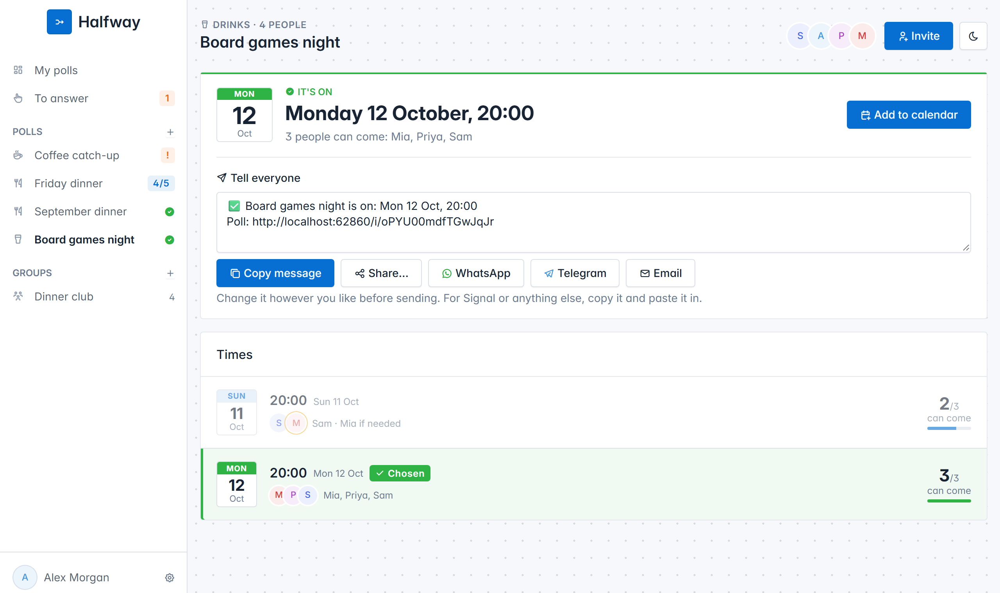
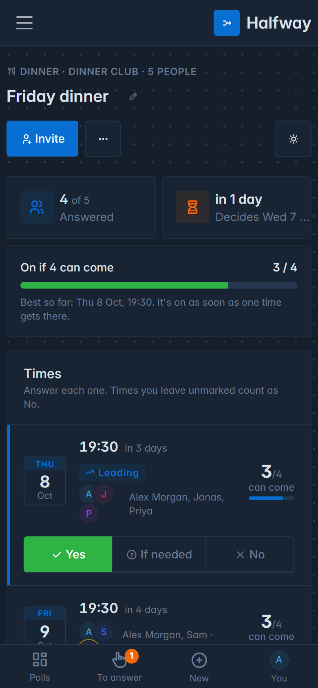
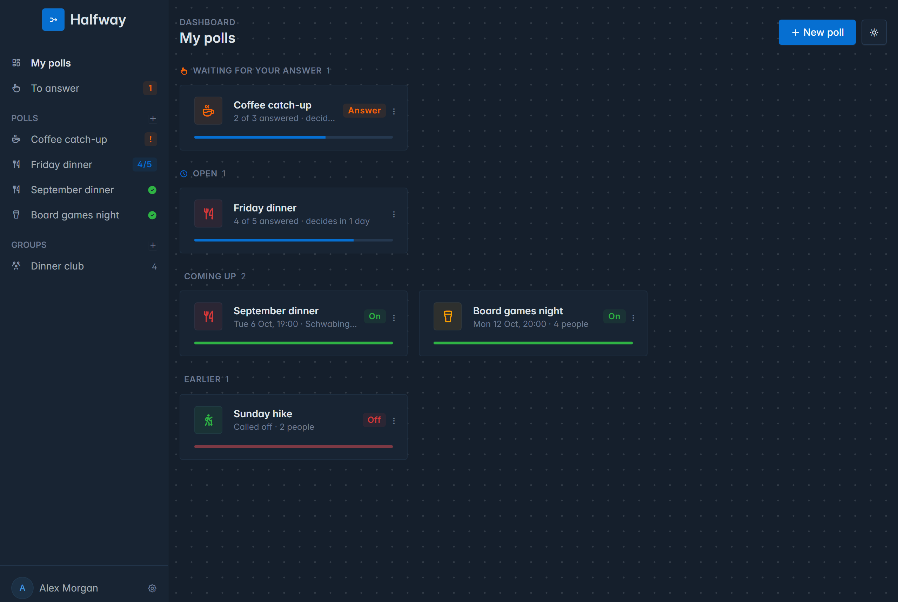
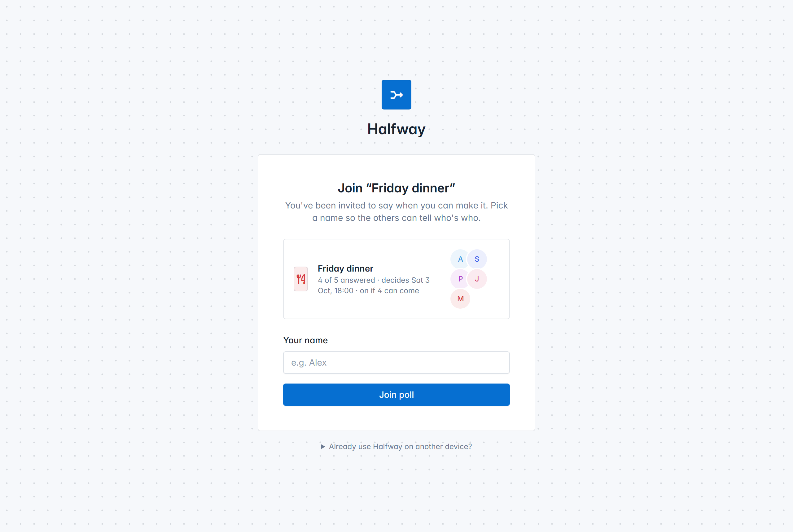
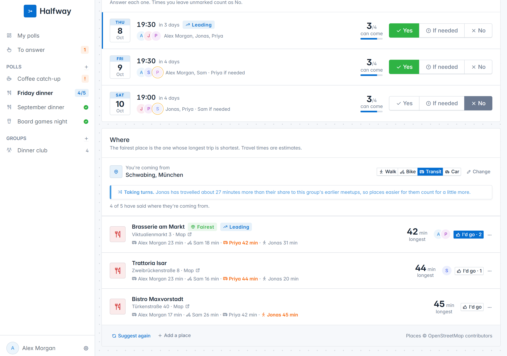
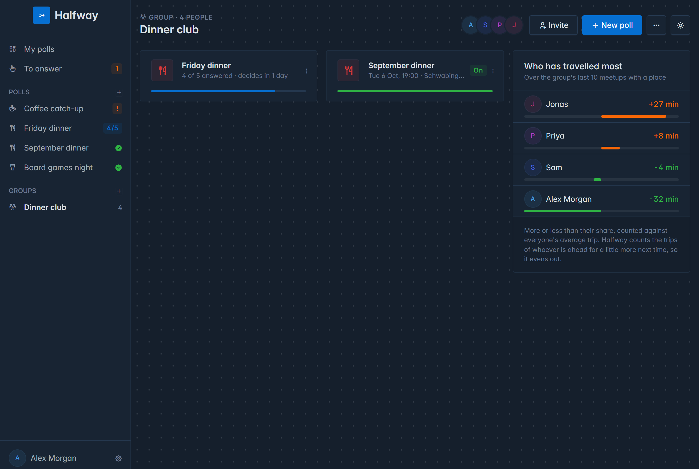

# Halfway

[](https://github.com/ReDCLiF-Unknow/halfway/actions/workflows/ci.yml)
[](LICENSE)

A poll that settles when friends meet, and then makes the decision for them: Go, SQLite, `html/template`,
and the [Tabler](https://tabler.io) UI + Tabler Icons. Includes a CLI (Cobra + Resty) that talks to the
server's JSON API.

Doodle-style polls tend to die because nobody wants to be the one who calls it. Halfway calls it. Offer a
few times, send the link, and everyone says **Yes**, **If needed** or **No** to each. Give it a minimum
("on if 4 can come") and it is on the moment one time has that many; otherwise the deadline settles it on
the time most people said yes to. If no time gets there, it is called off, and nobody has to send the
awkward "so... never mind".

It can settle **where** too. Everyone says roughly where they are coming from, and Halfway suggests the
places whose longest trip is shortest, rather than the middle of a map, which can as easily be a lake. Each
place shows how long everyone takes to get there; people vote, and the decision names the place. A group
that meets every month remembers who travelled farthest last time, and takes turns.

There is no sign-up form, no password and no email. You type your name once, and every poll you open
after that knows who you are.

One binary serves everything, including its own CSS, JavaScript and fonts, so a page load reaches nothing
but your own server: no CDN learns who is planning what with whom, and it works on a network with no way
out. The exceptions are telling a group chat (Telegram, or a Discord channel an organizer connects) and
finding places, none of which sends anything until someone turns it on (see
[Telling a group chat](#telling-a-group-chat) and [Where to meet](#where-to-meet)).

<picture>
  <source media="(prefers-color-scheme: dark)" srcset="docs/poll-dark.png">
  
</picture>

<table>
<tr>
<td width="68%"></td>
<td width="32%"></td>
</tr>
<tr>
<td><em>Decided: add it to your calendar, and tell everyone</em></td>
<td><em>On a phone</em></td>
</tr>
<tr>
<td colspan="2"></td>
</tr>
<tr>
<td colspan="2"><em>My polls: what needs your answer, what is open, what is on</em></td>
</tr>
<tr>
<td colspan="2"></td>
</tr>
<tr>
<td colspan="2"><em>An invite link, opened by somebody new: a name and they're in</em></td>
</tr>
<tr>
<td colspan="2"></td>
</tr>
<tr>
<td colspan="2"><em>Where: the places with the shortest longest trip, and everyone's time to each</em></td>
</tr>
<tr>
<td colspan="2"></td>
</tr>
<tr>
<td colspan="2"><em>A group: its polls, and who has travelled most, so it can take turns</em></td>
</tr>
</table>

## Install

**Docker**: the image carries the server and the CLI, and nothing else is needed:

```
docker run -d --name halfway -p 8080:8080 -v halfway:/data -e TZ=Europe/Berlin ghcr.io/redclif-unknow/halfway:latest
```

Or with the [compose file](compose.yaml): `docker compose up -d`. The database lives in the `/data`
volume, so it survives upgrades. Images are built for amd64 and arm64, so a Raspberry Pi works too.

`:latest` is the newest release; pin a version instead (`:v1.0.0`) if you'd rather upgrade
deliberately. `:main` is built from the development branch and is not promised to work.

**A prebuilt binary**: download the archive for your system from the
[latest release](https://github.com/ReDCLiF-Unknow/halfway/releases/latest), unpack it, and run
`halfway-server` (`halfway` beside it is the CLI). There is nothing to install alongside it: the database is a SQLite file created
on first run.

Either way, open <http://localhost:8080> and type your name.

## Time zone

**Every time on every poll is in the server's time zone.** "Thursday 19:30" means the same to everyone on
a poll, which is what a group meeting in one city wants, so it is set once, for the server, with `TZ`:

- **Docker**: `-e TZ=Europe/Berlin` (the image defaults to `UTC`). The zone database is compiled into the
  binary, so any name from the [list](https://en.wikipedia.org/wiki/List_of_tz_database_time_zones) works.
- **The binary**: it uses your computer's zone, or `TZ` if you set it.

The server says which zone it is using when it starts: `times are in Europe/Berlin`.

## Keep the database

**Every poll is in one SQLite file, and nothing else anywhere knows about them.** If a server starts without
that file, it makes a new, empty one: every poll is gone, and every link made before then leads nowhere.

So put the database somewhere that outlasts a restart, an upgrade and a redeploy:

- **Docker**: give `/data` a volume, as the command above does with `-v halfway:/data`. Without one,
  Docker gives each new container a fresh anonymous volume, so replacing the container to upgrade
  quietly starts from nothing. The compose file sets one up.
- **A hosting platform** (Coolify, Railway, Fly.io, Render and the like): add its persistent storage
  and mount it at `/data`. Many of them throw the container's disk away on every deploy.
- **The binary**: `halfway.db` is created in the folder you run it from. Unpacking a new release into
  a new folder and running it there starts a new, empty database; pass the old one with
  `-db C:\path\to\halfway.db`, or run it from the same folder.

The server says what it found every time it starts. A database it already had:

```
database: /data/halfway.db, 12 people
```

and one it had to create, loudly, because that is either a first run or the moment everything went missing:

```
database: created a new, empty one at /data/halfway.db

    If this is not the first time this server has started, its polls are not
    where it is looking, and every link made before now will lead nowhere.
    ...
```

## Run from source

```
go run ./cmd/server            # http://localhost:8080, database in ./halfway.db
go run ./cmd/server -addr localhost:9000 -db /path/to/halfway.db
```

SQLite is provided by the pure-Go `modernc.org/sqlite`, so no C compiler is needed. It runs in
write-ahead logging mode, so reading carries on while somebody writes; back the database up with
`sqlite3 halfway.db ".backup out.db"` or while the server is stopped, rather than copying the file
from under it.

The stylesheets, scripts and fonts live in `internal/web/static/vendor/` and are compiled into
the binary, so building needs nothing but Go. To change a version, edit the numbers at the top of
[tools/vendor/fetch.py](tools/vendor/fetch.py) and run it; it re-downloads them and cuts the icon
font down to the icons the templates actually use (8KB rather than 844KB).

## Planning something

- **New poll.** Give it a name and a kind (coffee, dinner, drinks, hike, or anything else), offer up to
  8 times, and say when it decides. Leave the deadline empty and it is a day before the first time.
  **Create poll** takes you straight to its invite link.
- **Answering.** Each time has **Yes**, **If needed** and **No**; a click saves it. Times you leave
  unmarked count as No. Everyone sees who said what: yes in full, if needed with a dashed yellow ring.
  The time the poll is heading for is marked **Leading**.
- **The minimum.** "Only if at least 4 can come" makes it a Kickstarter for a night out: the moment any
  time has 4 people who can make it (if needed counts, as they said they can come), it is on. If no time
  gets there by the deadline, it is called off.
- **The deadline.** Without a minimum, the deadline decides: the time with the most yeses, with if-neededs
  breaking a tie, and the earlier time after that. It is called off only if nobody can make any time. The
  server keeps deadlines by itself, every few seconds, whether or not anyone has the page open.
- **Decided.** The poll page shows the time in large type with who can come, and **Add to calendar** (a
  `.ics` file to open in any calendar app). Nobody can answer any more.
- **Tell everyone.** Under the decision is a message ready to send: the time, the place with its address
  and a map link, and the poll's link. Change it however you like, then **Copy message**, or send it with
  **WhatsApp**, **Telegram** or **Email**, or **Share…** on a phone, which opens its own share menu. A poll
  that was called off gets one too. Nothing is sent by Halfway itself: these hand the message to the app
  you choose.
- **Organizers overrule.** The ⋯ menu has **Decide now**, which decides as if the deadline had passed,
  and **Deadline and minimum**; lower the minimum and a time that has enough already puts it on. Once it
  is decided, **Pick this time** beside any other time moves it there, or puts on one that was called off.
- **News.** My polls groups everything: waiting for your answer, open, coming up, and earlier. A poll
  decided since you last looked is marked **New**, its count is in the sidebar and in the browser tab's
  title, as in "(1) Halfway"; **To answer** counts the open polls still waiting for you.
- **Deleting.** An organizer deletes a poll for everyone from its card's ⋯ menu on My polls, from the
  ⋯ menu on the poll, or from the bottom of its Invite dialog. A "Poll deleted · Undo" toast brings it
  back, and so can any of its organizers for a day, after which it is gone for good. Everyone else can
  **Leave** a poll instead, which takes it off their list, and their answers with them while it is still open.
- **Live.** Answers, decisions and changes made by other people appear on your screen within a moment,
  via server-sent events (`/events`), without reloading.

## On your phone

The layout adapts to the screen: on phones and tablets the sidebar becomes a hamburger menu and a **bottom
tab bar** (My polls, To answer with its badge, New, and your profile) appears; Yes, If needed and No get a
line of their own under each time; touch targets are at least 44px; inputs are 16px so iPhones don't zoom
in when you tap them.

It is also **installable**: in Chrome/Edge choose *Install*, on iOS Safari *Share → Add to Home Screen*. You
get an icon and a window without browser chrome. It needs a connection to your server (it is not usable
offline). Installing from a non-`localhost` address needs HTTPS.

## Inviting people

There are no passwords. The first time someone opens Halfway they pick a **display name**; the server gives
their browser a secret key (in an `HttpOnly` cookie; only a hash is stored server-side).

- Every poll you create is **private** to the people on it. Press **Invite** for its **invite link**.
- **Somebody new** who opens it types a name and is on the poll. **Somebody with a name already** is
  added the moment they open it, and it is in their My polls from then on.
- **Link previews.** Paste the link into WhatsApp, Signal or any chat that shows previews, and the preview
  carries how the poll stands: "3 of 5 answered · decides Wed 7 Oct, 18:00", and once it is decided
  "✅ Thu 8 Oct, 19:30". Posting the same link again later is how a group without a bot hears the result.
- **Close to newcomers** once everyone is in: the people on it can still open it, nobody else can join
  (the preview still works). **Create a new link** stops the old one working at all.
- **Organizer link.** The Invite dialog also has a second link that makes whoever opens it an organizer,
  to run the poll together. It has its own **Create a new organizer link**.
- **People.** The dialog lists everyone, organizers marked, and who has answered. Organizers can take
  someone off (the second entry of somebody who joined again from a new device, say).
- **Another device.** In your profile, **Show a sign-in code** shows a QR code to scan with your phone (or a
  link to open on the other device). It works once, for 10 minutes, and asks before signing in, so a chat
  app's link preview cannot use it up. The device gets a key of its own, listed in your profile with
  **Sign out**, so one can be signed out without the others. The code is made of the address you reach the
  server at, so a phone can only use it if it can reach that address too.
- **Profile** (bottom of the sidebar) lets you rename yourself and shows your key. Pasting it on another
  device ("Already use Halfway on another device?") works too. Clearing your cookies
  without saving the key means losing that name, with no password to reset and no email to send, so every
  page says so until you have saved it (copying it counts).

Anyone holding an invite link can join, so treat it like a password for that poll and replace it if it
leaks. If you expose the server beyond your own network, put it behind HTTPS so keys and cookies are
protected. If you put it behind a reverse proxy, don't let the proxy buffer `/events` (the server sends
`X-Accel-Buffering: no` for nginx).

## Where to meet

A poll can find a place as well as a time: tick **Also find a place halfway between everyone** when making
it. It needs turning on for the server first (see below).

- **Where from.** On the poll, everyone can say roughly where they are coming from: search for a
  neighbourhood, street or station, or press **Use my location**. And how: **walk**, **bike**, **transit**
  or **car**. It is optional; people who skip it are just not counted.
- **Private.** Nobody sees where anyone else is coming from, only how long it takes them. The server
  rounds every starting point to about 500 m before storing it, and deletes it a week after the event.
- **Fair.** **Suggest places** looks for cafés, restaurants, bars or parks (by the poll's kind) around
  everyone, and suggests the three whose **longest** trip is shortest, rather than the middle of the map.
  Each shows everyone's time to it, the longest picked out, and the fairest is marked. **Suggest again**
  looks again, keeping the places people voted for.
- **Estimates.** Travel times are worked out from the distance and how someone travels, with allowances
  for streets not being straight and for waiting at stops. They are good for telling a fair place from an
  unfair one, so they are always "about"; they do not know timetables or traffic.
- **Voting.** **I'd go** on any places you would be happy with. When the poll is decided, the place with
  the most votes wins, the fairest breaking a tie. Organizers can **Add a place** of their own, **Settle
  on** one before the decision, and **Meet here instead** after it, which connected chats are told about.
- **Everywhere.** The decision names the place: on the poll, in the message to tell everyone, in the link
  preview, in the calendar file (with its address), and in the Telegram message.

**For whoever runs the server**: start it with `HALFWAY_PLACES=on`:

```
docker run ... -e HALFWAY_PLACES=on ghcr.io/redclif-unknow/halfway:latest
```

Searching and suggesting are done by this server, never by people's browsers, using OpenStreetMap's public
[Nominatim](https://nominatim.org) (for searching) and [Overpass](https://overpass-api.de) (for places).
Each is asked at most once a second, answers are kept for a day, and every request says it comes from
Halfway, as their usage policies ask. What they learn is what was searched for and the rough area being
looked in, not who asked.

| Variable | |
|---|---|
| `HALFWAY_PLACES=on` | turn finding places on |
| `HALFWAY_PLACES_CONTACT` | an email address or URL, sent with each request, for the services to reach you if they need to. Worth setting if many people use your server |
| `HALFWAY_NOMINATIM_URL`, `HALFWAY_OVERPASS_URL` | your own instances instead of the public ones, if you run them |

Place data is © [OpenStreetMap contributors](https://www.openstreetmap.org/copyright), available under the
Open Database Licence, and credited on every poll that shows it.

## Groups

For people who meet again and again (a dinner club, a team, a running group), make a **group** with the
**+** next to Groups in the sidebar, and send its invite link instead of each poll's.

- **Everyone, every time.** A poll made for the group (**New poll** on its page, or **Who's it for?** on the
  form) takes in everyone in it, and somebody joining the group later is added to its polls still open. Its
  organizers organize them all.
- **One chat for all of them.** Connect a Telegram group or a Discord channel to the group, from its Invite
  dialog, and every poll it makes tells that chat its decision, with nothing to set up each time.
- **Taking turns.** When a group's poll is decided at a place, Halfway keeps how long everyone took to get
  there: minutes only, never from where. The group's page shows who has travelled more than their share over
  its last 10 meetups, and who less. Next time, the trips of whoever is ahead count for a little more, half of
  what they are owed and never more than 15 minutes, so a place nearer them wins a close call, and over the
  months it evens out. The poll's Where card says when that is happening.

Deleting a group leaves its polls as they are, for the people on them.

## Telling a group chat

Halfway can post each decision into a **Telegram** group or a **Discord** channel, so the group hears where it already talks. There
is exactly one message per decision and nothing else: none when the poll is made, none while people answer.

| Decision | Message |
|---|---|
| Confirmed | ✅ Friday dinner is on: Thu 8 Oct, 19:30 · *link* |
| Called off | ❌ Friday dinner didn't reach 4 people and is cancelled |
| Moved by an organizer | 🔁 Friday dinner moved to Fri 9 Oct, 19:00 · *link* |

### Telegram

**For whoever runs the server**, once: create a bot with [@BotFather](https://t.me/BotFather) (`/newbot`),
and start the server with its token:

```
docker run ... -e HALFWAY_TELEGRAM_TOKEN=123456:ABC... ghcr.io/redclif-unknow/halfway:latest
```

The server says `telegram: on, as @YourBot` when it starts. The bot only posts and never reads the group, so
its privacy mode can stay on. Without a token nothing ever leaves the server, and the Invite dialog says
Telegram is not set up.

**For a poll's organizer**: in the Invite dialog, press **Add to a Telegram group**, pick the group and add
the bot. It says hello in the group, and the dialog lists the group as connected. A group connected to a
poll hears about decisions made after it was connected. If the bot is removed from the group, the dialog
says so and asks you to add it again.

### Discord

A poll's organizer can connect a Discord channel without anything set up on the server: in Discord, open
the channel's settings, **Integrations**, **Webhooks**, make one and **Copy Webhook URL**; then paste it under
**Or a Discord channel** in the Invite dialog. Halfway checks it with Discord, lists the channel as connected,
and posts the same one message per decision. Mentions are switched off, so a poll called "@everyone" pings
nobody. If the webhook is deleted, the dialog says so.

The webhook URL works like a password for posting into that channel, so it is never shown again once
pasted, and the server only ever sends to `https://discord.com/api/webhooks/...` addresses, whatever is
pasted. Whoever runs the server can turn Discord off with `HALFWAY_DISCORD=off`.

### WhatsApp and Signal

WhatsApp and Signal cannot be told: neither lets a bot post into an existing friends' group. Their groups
see the result in the link preview, or on the poll page.

## CLI

```
go build -o halfway ./cmd/halfway

halfway register "Alex"        # pick a name; prints your sign-in key
export HALFWAY_TOKEN=<key>     # PowerShell: $env:HALFWAY_TOKEN = "<key>"

halfway new "Friday dinner" --kind dinner --min 4 \
  --time "2026-10-09 19:30" --time "2026-10-10 19:30" --deadline "2026-10-08 18:00"
halfway polls                  # every poll you are on, and where each stands
halfway show 3                 # its times, numbered, who can come, and your answers
halfway answer 3 2 yes         # time 2: yes (or maybe, or no)
halfway join https://host/i/CODE
halfway invite 3               # print the invite link (--organizer for the organizer link)
halfway decide 3               # decide now, as if the deadline had passed (organizers)
halfway pick 3 1               # make it time 1, whatever the answers say (organizers)
halfway leave 3
halfway rm 3                   # delete it for everyone (organizers)
halfway restore 3              # undo that, within a day
halfway whoami
```

Use `-s http://host:port` / `HALFWAY_SERVER` to pick the server (default `http://localhost:8080`) and
`-t KEY` / `HALFWAY_TOKEN` for who you are. The key from the web profile works too, so the terminal and the
browser are the same person.

## JSON API

Send `Authorization: Bearer <key>` to act as a person. A poll you are not on returns `404`, the same as one
that does not exist. Times are written `YYYY-MM-DD HH:MM` (or with a `T`), in the server's time zone.

| Method | Path | Body |
|---|---|---|
| POST | `/api/users` | `{"name": "..."}` → `{id, name, token}` |
| GET | `/api/me` | |
| GET | `/api/polls` | every poll you are on, with how many have answered, whether you have, and what it was decided for |
| POST | `/api/polls` | `{"title": "...", "category": "dinner", "times": ["2026-10-09 19:30", ...], "deadline": "...", "quorum": 4, "places": true}`; only `title` and `times` are needed |
| POST | `/api/join` | `{"link": "https://host/i/CODE"}`: an invite or organizer link, or just its code |
| GET | `/api/polls/{id}` | the poll, its `times` (numbered from 1, each with its votes and `your_answer`), `people`, `invite_url`, `organizer_url` for organizers, and `venue` once one is chosen |
| POST | `/api/polls/{id}/answers` | `{"time": 2, "answer": "yes"}`: the time's number (or `"time_id"`), and `yes`, `if-needed` (or `maybe`) or `no` |
| POST | `/api/polls/{id}/leave` | |
| POST | `/api/polls/{id}/decide` | organizers |
| POST | `/api/polls/{id}/pick` | `{"time": 1}`; organizers |
| DELETE | `/api/polls/{id}` | organizers; it can be restored for a day |
| POST | `/api/polls/{id}/restore` | organizers, within a day of deleting it |

## Tests

```
go test ./...
```

Every push and pull request runs the same tests on GitHub, along with `gofmt`, `go vet`, a cross-compile of
each released platform, and a build of the Docker image. CI also starts the built container, picks a name,
makes a poll, opens it, and stops the container, so the image is known to work rather than merely to
compile. The CLI is tested the way it is used: each command runs against a real server and its output is read
back. The Telegram bot is tested against a stand-in for Telegram's Bot API, and finding places against stand-ins for\nNominatim and Overpass, so no test ever reaches the real services.

The screenshots above are generated rather than taken by hand, so they can be redone whenever the UI changes:

```
python tools/screenshots/shoot.py
```

It starts a server on a spare port with a stand-in for OpenStreetMap, fills it with a few friends planning a
few things, photographs it with
headless Chrome and writes the PNGs into `docs/`, cleaning up after itself. It needs Go, Chrome and
`python -m pip install websockets`.

## Licence

[MIT](LICENSE): use it, change it, share it, sell it; just keep the copyright notice.

It stands on other people's open source work: [Tabler](https://tabler.io) and
[Resty](https://github.com/go-resty/resty) (MIT), [Cobra](https://github.com/spf13/cobra) (Apache 2.0),
[modernc.org/sqlite](https://gitlab.com/cznic/sqlite) and [rsc.io/qr](https://github.com/rsc/qr)
(BSD-3-Clause). Tabler's CSS and icons and the
[Inter](https://rsms.me/inter/) typeface (SIL Open Font License 1.1) are redistributed inside the binary;
their licences sit beside them in [internal/web/static/vendor](internal/web/static/vendor).
